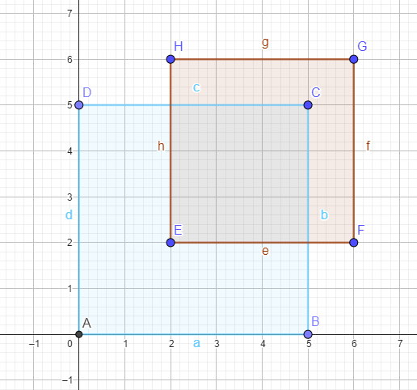
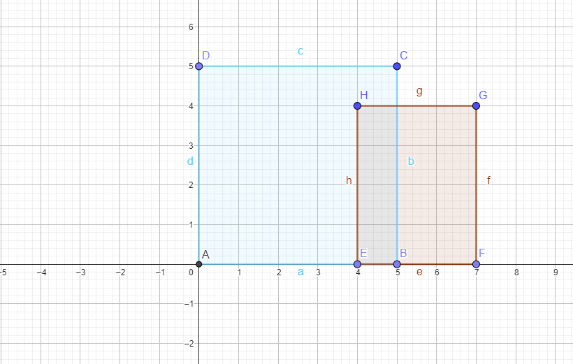
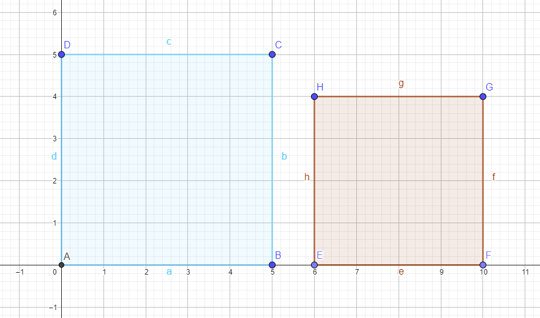
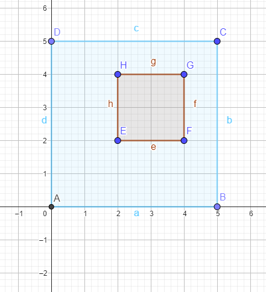
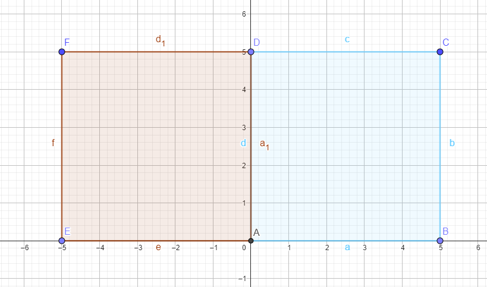
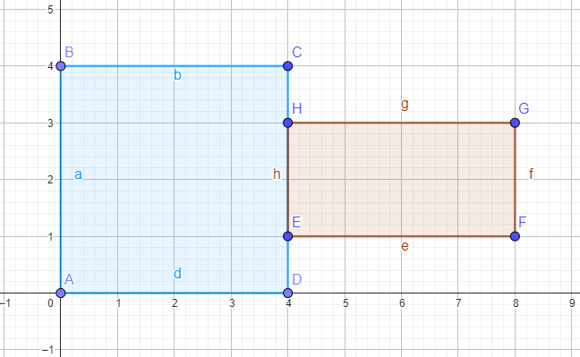
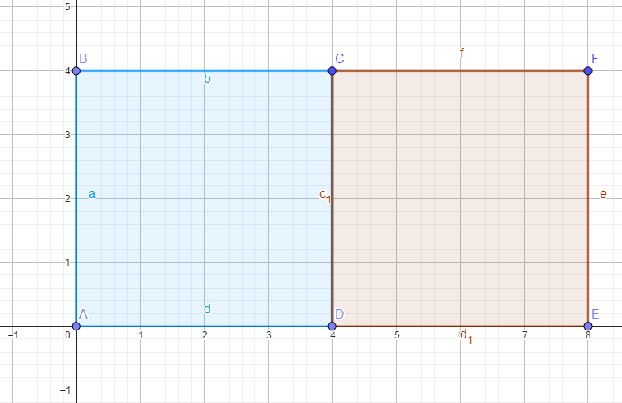
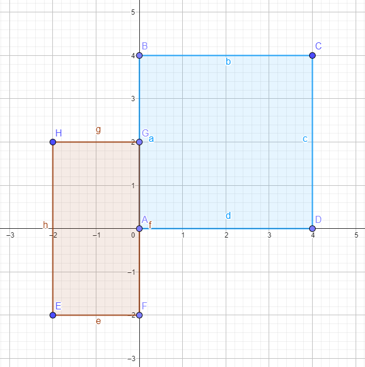
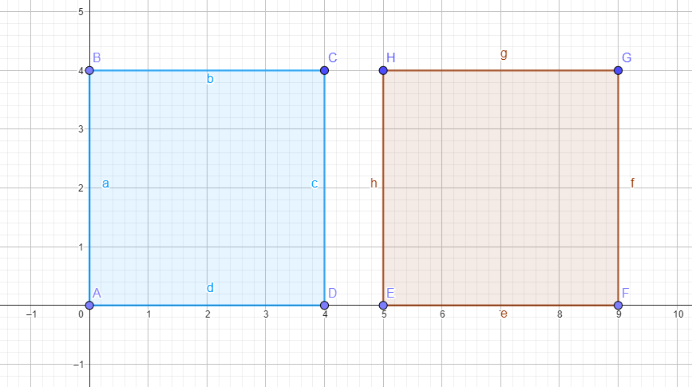

# Rectangles Algorithms

This repository contains a .Net Solution file (.sln) which has an ASP.Net Web application (API) to interact with the user's request.
It allows to execute and verify proposed Rectangle Algorithms (Intersection, Containment, and Adjacency).

## Projects

- **Rectangles.Challenge.Api**: Application entry point that exposes an API endpoint to test/execute Rectangle Algorithms.
- **Rectangles.Challenge.Core**: Main project. It contains the implementation for each Algorithm, also we can find **Rectangle** entity/model 
definition among others.
- **Rectangles.Challenge.Tests**: Unit Tests project. It has a specific Test Class for each Algorithm. 
Additionally, we have a visual reference of each test case (Go to [Test cases...](./Rectangles.Challenge.Tests/Algorithms/References)). 

## Dependencies

Project developed by using .Net version 7. To be able to run the application from an IDE. We must use latest version of IDEs (Visual Studio 2022, Rider, or VSCode).
However, cloning repository and running application from Command Line. It's the recommended option.

- [.Net 7 SDK](https://dotnet.microsoft.com/en-us/download/dotnet/7.0)
- [Ardalis.StartEnum](https://github.com/ardalis/SmartEnum) (Library)
- Swashbuckle (Swagger/OpenAPI support)

## Run application

- Make sure host machine has installed .Net7 SDK (Runtime and ASP.Net Core Runtime).
- Clone repository.
- Using a Command Line prompt. At root repository folder. Execute below command. It will build and run application.
```batch
dotnet run -c Release --project Rectangles.Challenge.Api/Rectangles.Challenge.Api.csproj
```
- Application listens to HTTP requests at port 5157 by default.
- Use [Postman](https://www.postman.com/downloads/) or any tool to consume API services. 
  - As suggested option. Open a new browser Tab/Window and navigate to http://localhost:5157/swagger/index.html. That will take you to Swagger page. 

## Rectangle entity

Rectangle can be represented by using different alternatives. Dev Team has decided to use two main elements to represents a Rectangle.

- Point: It's an entity/model that indicates the values for X and Y axis. 
- Size: It indicates Width and Height sizes for an element.

A rectangle is made up of Point and Size elements. The point represents the source of the Rectangle. 
In our case, it will be the bottom left point of the rectangle (Important).

Example:
```json lines
/* Rectangle */
{
  "bottomLeft": {
    "x": 0,
    "y": 0
  },
  "size": {
    "width": 4,
    "height": 4
  }
}
```

## Rectangle Algorithms API

API exposes an POST endpoint to verify and execute the Rectangle Algorithms. You can try it out via Postman or Swagger.

HTTP Method: POST \
URL: http://localhost:5157/api/Rectangles/Algorithms \
Request Body:
```json lines
{
  "primary": {
    "bottomLeft": {
      "x": 0,
      "y": 0
    },
    "size": {
      "width": 0,
      "height": 0
    }
  },
  "secondary": {
    "bottomLeft": {
      "x": 0,
      "y": 0
    },
    "size": {
      "width": 0,
      "height": 0
    }
  },
  "algorithm": "string" /* Intersection, Containment, Adjacency or All */
}
```
Response: The **result** property will indicate the outcome of evaluating the Algorithm(s).
```json lines
{
  "result": "Intersection [(1, 2)]"
}
```

## Algorithms

[For more examples](./Rectangles.Challenge.Tests/Algorithms/References)

### Intersection



API Request:
```json lines
{
  "primary": {
    "bottomLeft": {
      "x": 0,
      "y": 0
    },
    "size": {
      "width": 5,
      "height": 5
    }
  },
  "secondary": {
    "bottomLeft": {
      "x": 2,
      "y": 2
    },
    "size": {
      "width": 4,
      "height": 4
    }
  },
  "algorithm": "Intersection"
}
```
Response:
```json lines
{
  "result": "Intersection [(2, 5),(5, 2)]"
}
```

## Intersection Special case



API Request:
```json lines
{
  "primary": {
    "bottomLeft": {
      "x": 0,
      "y": 0
    },
    "size": {
      "width": 5,
      "height": 5
    }
  },
  "secondary": {
    "bottomLeft": {
      "x": 4,
      "y": 0
    },
    "size": {
      "width": 3,
      "height": 3
    }
  },
  "algorithm": "Intersection"
}
```
Response:
```json lines
{
  "result": "Intersection [(4, 0),(5, 0),(5, 3)]"
}
```

## No Intersection



API Request:
```json lines
{
  "primary": {
    "bottomLeft": {
      "x": 0,
      "y": 0
    },
    "size": {
      "width": 5,
      "height": 5
    }
  },
  "secondary": {
    "bottomLeft": {
      "x": 6,
      "y": 0
    },
    "size": {
      "width": 4,
      "height": 4
    }
  },
  "algorithm": "Intersection"
}
```
Response:
```json lines
{
  "result": "No Intersection"
}
```

## Containment



API Request:
```json lines
{
  "primary": {
    "bottomLeft": {
      "x": 0,
      "y": 0
    },
    "size": {
      "width": 5,
      "height": 5
    }
  },
  "secondary": {
    "bottomLeft": {
      "x": 2,
      "y": 2
    },
    "size": {
      "width": 2,
      "height": 2
    }
  },
  "algorithm": "Containment"
}
```
Response:
```json lines
{
  "result": "Containment"
}
```

## Not Containment



API Request:
```json lines
{
  "primary": {
    "bottomLeft": {
      "x": 0,
      "y": 0
    },
    "size": {
      "width": 5,
      "height": 5
    }
  },
  "secondary": {
    "bottomLeft": {
      "x": 5,
      "y": 0
    },
    "size": {
      "width": 5,
      "height": 5
    }
  },
  "algorithm": "Containment"
}
```
Response:
```json lines
{
  "result": "Not Containment"
}
```

## Adjacency (Sub-line)



API Request:
```json lines
{
  "primary": {
    "bottomLeft": {
      "x": 0,
      "y": 0
    },
    "size": {
      "width": 4,
      "height": 4
    }
  },
  "secondary": {
    "bottomLeft": {
      "x": 4,
      "y": 1
    },
    "size": {
      "width": 4,
      "height": 2
    }
  },
  "algorithm": "Adjacency"
}
```
Response:
```json lines
{
  "result": "Adjacent (Sub-line)"
}
```

## Adjacency (Proper)



API Request:
```json lines
{
  "primary": {
    "bottomLeft": {
      "x": 0,
      "y": 0
    },
    "size": {
      "width": 4,
      "height": 4
    }
  },
  "secondary": {
    "bottomLeft": {
      "x": 4,
      "y": 0
    },
    "size": {
      "width": 4,
      "height": 4
    }
  },
  "algorithm": "Adjacency"
}
```
Response:
```json lines
{
  "result": "Adjacent (Proper)"
}
```

## Adjacency (Partial)



API Request:
```json lines
{
  "primary": {
    "bottomLeft": {
      "x": 0,
      "y": 0
    },
    "size": {
      "width": 4,
      "height": 4
    }
  },
  "secondary": {
    "bottomLeft": {
      "x": -2,
      "y": -2
    },
    "size": {
      "width": 2,
      "height": 4
    }
  },
  "algorithm": "Adjacency"
}
```
Response:
```json lines
{
  "result": "Adjacent (Partial)"
}
```

## Not Adjacent



API Request:
```json lines
{
  "primary": {
    "bottomLeft": {
      "x": 0,
      "y": 0
    },
    "size": {
      "width": 4,
      "height": 4
    }
  },
  "secondary": {
    "bottomLeft": {
      "x": 5,
      "y": 0
    },
    "size": {
      "width": 4,
      "height": 4
    }
  },
  "algorithm": "Adjacency"
}
```
Response:
```json lines
{
  "result": "Not adjacent"
}
```
